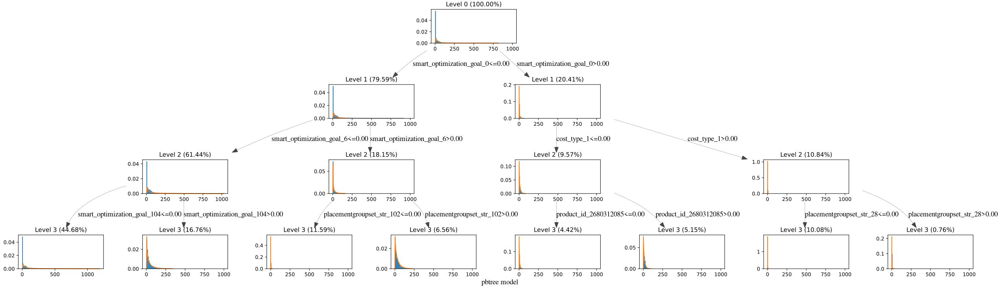
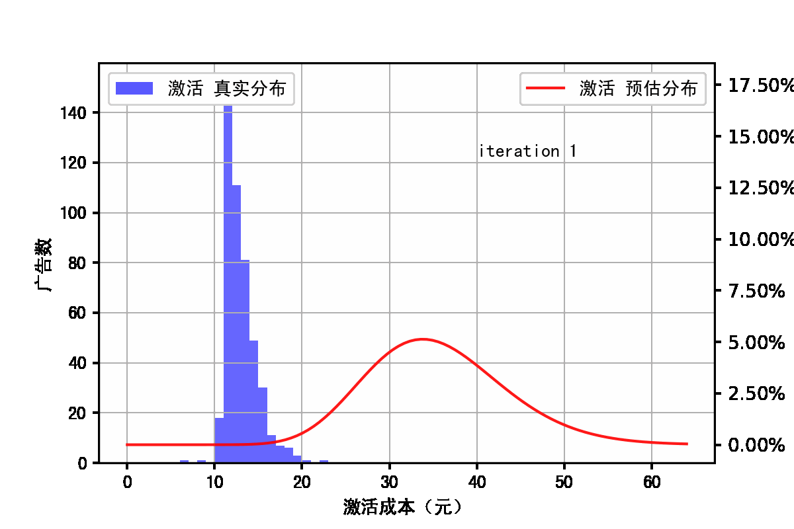

# pbtree
This project provides a framework for distribution prediction by Probability Boosting TREE method. This framework can be used to predict various types of distributions for target variables, currently normal and gamma distributions are mainly supported.

# 概率提升树

## 简介

目前主流的机器学习工具一般都是基于点估计，即只估计目标分布的均值，例如xgboost、lightgbm、LR等。这在大多数场景下是适用的，但是在某些场景下（例如小样本，或者需要强解释），我们不仅希望预估均值，还希望预估置信区间。当前的一些工具并不能很好的满足需求。

我们希望开发一款具有以下特点的工具：

- 支持预估目标的全部分布参数。
- 支持工业界的应用：支持多线程训练、预估，支持在线服务。
- 支持特征交叉。
- 具有较好的解释性。

我们通过两个图形给出PBTree的直观解释。

1. PBTree的单颗树的示意图如下：


2. PBTree对分布的拟合过程例子如下图所示：



## 部署

您可以直接从源码编译，需要：

- gcc version >= 8.2
- cmake version >= 3.15

以linux系统为例：
```
# 准备编译环境，包括gcc-c++/git/cmake，如果您已经安装过，可以忽略这一步
sudo yum install gcc-c++ libstdc++-devel git cmake
# 下载代码
git clone https://github.com/paleyl/pbtree.git
cd pbtree/thirdparty
# 获取并编译第三方依赖，pbtree依赖glog/gflags/gperftools/protobuf/boost
# 在编译google的库时可能会遇到一些配置问题需要手动解决。
sh get_thirdparty.sh 
cd ..
mkdir build & cd build
# 编译
cmake ..
make
# 部署
mkdir ../bin
cp pbtree ../bin
cd ..
```

## 使用

编译完成后，使用data中的数据进行测试。训练数据使用libsvm格式。
```
# 创建输出路径
mkdir -p {log,model}
# 切换到部署路径
cd bin
# 训练
./pbtree --flagfile=../conf/pbtree.train.flags
# 测试
./pbtree --flagfile=../conf/pbtree.test.flags
```

## 原理介绍
原理请参见 [文档](doc/pbtree_km.pdf)。

## 添加功能
最常见的需求应该是添加对新的参数分布的支持，可以参考distribution/gamma_distribution.h中的GammaDistribution类，开发成您需要的分布。