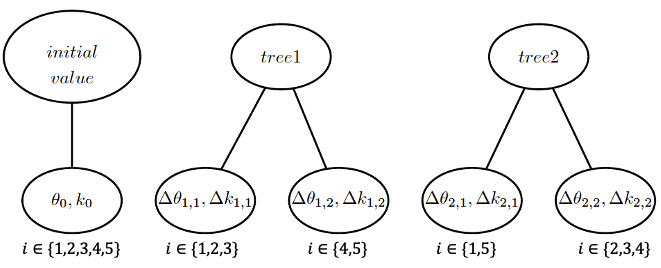

<div align='center' ><font size='70'>Probabilistic Boosting Tree</font></div>

# 背景

在真实的机器学习问题中，我们有时不仅要预估目标的均值，还要对目标取值的置信区间进行预估。特别是样本量比较少的场景下，比如广告营销的成本管理、金融产品的定价等，行为频率低，样本获取的成本高昂，单次行为背后往往都有大额的资金成本。这类相对低频的问题往往需要较深的人工干预，预估其目标变量的分布将为商业决策行为提供更充分的参考和依据。

特别的，对于我们的广告粒度的成本预估场景，广告的成本分布受到各种因素的影响，这些因素不仅影响成本分布的均值（一阶矩 mean），还影响分布的方差（二阶矩 variance），偏度（三阶矩 skewness），峰度（四阶矩 kurtosis）。为了能够准确的预估成本的置信区间，我们先要预估成本的分布。

在我们遇到的广告粒度的成本预估场景中，我们能够满足以下需求的一款开箱即用概率预估工具：

- 预估精度：预估精度高，支持连续特征、离散特征、特征交叉，点估计精度至少不低于Xgboost。
- 求解复杂度：在有限时间内能完成广告场景下工业级数据规模的模型求解。
- 线上服务：能够集成到线上的C++编写的线上服务，且能够满足10ms的返回。

目前我们调研到的一些比较有代表性的分布预估方案中，其优缺点列举如下：

| 模型名称|简介|现有实现方式|精度满足业务需求|求解复杂度|支持线上服务|
|-|-|-|-|-|-|
|Gaussian Process Regression [NIPS 1995]|用于时间序列等序列数据场景的概率预估，求解计算量大。|Python/R|x|x|x|
|GAMLSS [JSS 2007]|使用广义加法模型分别预估均值、方差、偏度、尖度，本质上仍然是线性模型，精度较差|Python/R|x|$\checkmark$|x|
|BART[AOAS 2010]|Bayesian Additive Regression Tree，属于非参数模型，使用采样技术进行概率预估，计算量大|Python/R|$\checkmark$|x|x|
|XGBOOST [2016 KDD] + Quantile Regression|Quantile Regression思路，每个分位训练一个模型，灵活性较差|C++|x|$\checkmark$|$\checkmark$|
|NGBOOST [ICML 2020]|用分布的自然梯度（Natural Gradient）代替参数梯度，在实现上需要频繁的对参数的信息矩阵(FIM)求逆。|基于Sk-learn|$\checkmark$|x|x|
|PGBM[SIGKDD 2021]|用gradient boosting的方式预估分布的一阶矩和二阶矩，（一阶矩和二阶矩不能完全确定一个分布）|基于PyTorch|x|$\checkmark$|x|

经过调研，有几点结论：

- 概率预估问题，近年来越来越受到机器学习和数据挖掘领域的关注，十年前的一些经典工具和论文，主要发表在统计学刊物上，而近两年比较有代表性的NGBOOST和PGBM开始出现在ICML和KDD这样的机器学习顶会上。
- 目前对于概率预估，仍然是学术界的探讨较多，目前暂时没有适合工业界是用的开箱即用的工具包。

对于我们要解决的生产场景下的成本、曝光、转化分布问题，目前暂无案例可供借鉴，也无成熟的框架可供使用，因此我们提出了Probabilistic Boosting Tree的框架。

# 模型设计
设$y$为要估计的变量，$x$是我们观测到的特征，我们需要计算目标变量$y$的分布，也即：$p(y|x)$。
我们使用boosting tree的思路对目标进行估计。

设树模型$T_j$的每个叶子节点$l$都是一个分布函数$p_{l}(y)$。那么单颗树模型可以表示为：

$$p_{T_j}(y|x_i)=p_{j,l}(y),  x_i\in S_{j,l}$$

包含d颗树的概率模型可以表示为：

$$p(y|x)=\frac{\prod_{j=1}^{d}{p_{T_j}(y|x)}}{C}$$
或者，
$$p(y|x_i)=\frac{\prod_{j=1}^{d}{p_{j,l}(y)}}{C},  x_i\in S_{j,l}$$

这里$C$相当于归一化项。从贝叶斯的角度来理解，

$$q_{T_{m}}(y|x)=\frac{p_{T_m}(y|x)\prod_{i=0}^{m-1}{p_{T_i}(y|x)}}{C}$$

$q_{T_{m-1}}(y|x)=\prod_{i=0}^{m-1}{p_{T_i}(y|x)}$相当于先验概率，$p_{T_m}(y|x)$相当于似然，$q_{T_{m}}$相当于后验概率。

这里我们希望先验概率和后验概率有相同的数学表达，例如都服从Gamma分布（Gamma分布的定义域为0到正无穷，可能比正太分布更适合刻画某些真实场景下的问题）。

$$q_{T_m}(y|x)=\frac{1}{\Gamma(k_m){\theta_m}^{k_m}}y^{k_m-1}e^{-\frac{y}{\theta_m}}$$

这时上式子中的似然函数的表达式会比较复杂，但如果我们仅仅对比先验分布与后验分布的差异，可以发现，先验分布乘以似然函数并且归一化以后，后验分布相对于先验分布的变化为：$k_{m-1} \rightarrow k_{m}$，$\theta_{m-1} \rightarrow \theta_{m}$。

设$k_m=k_{m-1}+\Delta k$，$\theta_m=\theta_{m-1}+\Delta \theta$，因此我们只需要求解$\Delta k$和$\Delta \theta$。



- $\theta_{2,1} = \theta_0 + \Delta \theta_{1,1} + \Delta \theta_{2,1}$
- $\theta_{2,2} = \theta_0 + \Delta \theta_{1,1} + \Delta \theta_{2,2}$
- $\theta_{2,5} = \theta_0 + \Delta \theta_{1,2} + \Delta \theta_{2,1}$

设有n条样本，则第$m$轮的损失函数为：


$$L_m = -log(\prod_{i=1}^{n}{p(y_i|k_{m-1,i}+\Delta k_{m,l}, \theta_{m-1, i}+\Delta \theta_{m,l})}),  \ \ \ i \in S_{m,l}$$

$$k_{m-1, i}=k_0 + \sum_{j=1}^{m-1}\Delta k_{j,l}$$

$$\theta_{m-1, i}=\theta_0 + \sum_{j=1}^{m-1}\Delta \theta_{j,l}$$

$i \in S_{m,l}$表示样本$i$在第$m$轮被划分到第$l$个叶子节点。

寻找分裂点和求解$\Delta \theta$、$\Delta k$的目标是使得上式最小化。

$$\mathop{\arg\min}\limits_{S, \Theta, K}L_m$$

# 求解

$$L_m = -log(\prod_{i=1}^{n}{p(y_i|k_{m-1,i}+\Delta k_{m,l}, \theta_{m-1, i}+\Delta \theta _{m,l})})=-\sum_{i=1}^{n}log(p(y_i|k_{m-1,i}+\Delta k_{m,l}, \theta_{m-1, i}+\Delta \theta _{m, l}))
$$

设第$m$轮的节点$l$的样本为$(x_i, y_i), i = \{1...s\}$。 采用类似梯度下降的方法：
$$\frac{\partial L_m}{\partial k_{m-1,l}} = -\sum_{i=1}^s{(log(\frac{y_i}{\theta_{m-1,l}})+\psi(k_{m-1,l}))}$$

$$\frac{\partial L_m}{\partial \theta_{m-1,l}} = -\sum_{i=1}^s{(\frac{y_i}{\theta_{m-1,l}^2} - \frac{k_{m-1,l}}{\theta_{m-1,l}})}$$

设学习率为$\eta_1, \eta_2$，则
$$\Delta k_{m,l}=\eta_1 \frac{\partial L_m}{\partial k_{m-1,l}}$$


$$\Delta \theta_{m,l}=\eta_2 \frac{\partial L_m}{\partial \theta_{m-1,l}}$$

# 效果


# 附录
寻找分裂点的伪代码如下： 

```
## 假设有F个特征，特征i的候选分裂点数量为C，当前结点有S条样本，
## S_L为左子节点的样本集，S_R为右子节点的样本集。
min_loss = inf
For i in (1 to F):
    For j in (1 to C):
        S_L = empty
        S_R = empty
        For k in (1 to S):
            if (x_ik < C_j):
                S_L <- k
            else:
                S_R <- k
        ## 计算梯度
        g_L = calculate_gradient(S_L)
        g_R = calculate_gradient(S_R)
        ## 计算损失函数
        loss_L = calculate_loss(S_L, g_L)
        loss_R = calculate_loss(S_R, g_R)
        loss = loss_L + loss_R
        if (loss < min_loss):
            best_split = i, j
```